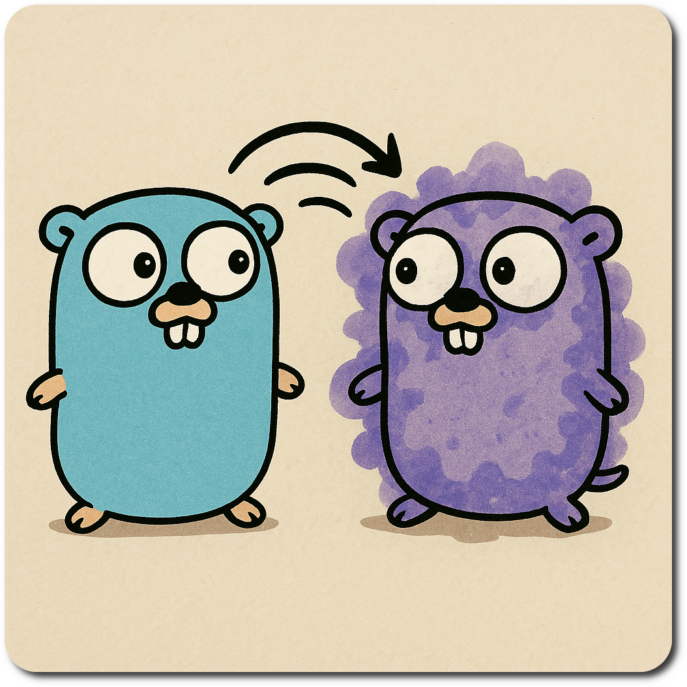

# GoGo - Go Code Generation Made Simple

[](https://goreportcard.com/report/github.com/guillermo/gogo)
[](https://godoc.org/github.com/guillermo/gogo)
[](https://github.com/guillermo/gogo/blob/main/LICENSE)




A powerful yet simple Go library for **programmatically generating and modifying Go source files**. Built for creating ORMs, code generators, scaffolding tools, and template-based code generation.

## 🎯 Why GoGo is Different

**GoGo is the first code generator that respects your changes.** Unlike traditional generators that blindly overwrite files, GoGo:

- ✨ **Preserves manual edits** - Your custom code stays untouched
- 🔍 **Tracks code across files** - Move a struct to another file? GoGo finds it
- 🤝 **Works with you, not against you** - Edit generated code freely
- 📊 **Shows diffs before applying** - See exactly what will change
- 🔄 **Intelligent merging** - Updates only what needs updating

## ✨ Features

### 🎯 Core Package (`gogo`)
Direct code manipulation with a clean, intuitive API:

- **Structs** - Create and modify struct definitions with fields, types, and tags
- **Methods** - Add methods with custom receivers, parameters, and return types
- **Functions** - Generate standalone functions with any signature
- **Variables & Constants** - Create package-level declarations
- **Types** - Define type aliases and custom types
- **Smart Diffs** - Preview changes before applying with automatic diff generation
- **Conflict Resolution** - Interactive or automatic change approval workflows

### 🔄 Template Package (`gogo/template`)
Transform existing Go code into templates for code generation:

- **Parse Go Projects** - Extract AST from any Go codebase
- **Rename Everything** - Structs, fields, functions, variables, constants, types
- **Modify Structures** - Add/remove struct fields dynamically
- **Extract Definitions** - Convert parsed code into gogo-compatible structs
- **Immutable API** - All transformations return new instances for safe chaining
- **Perfect for ORMs** - Use one model as a template for generating others

## 🚀 Quick Start

### Basic Usage - Generate Code

```go
package main

import (
    "github.com/guillermo/gogo"
)

func main() {
    // Create a new project (NewFS is a convenience function)
    prj, _ := gogo.NewFS("./output", gogo.Options{
        InitialPackageName: "models", // Only use the first time.
        ConflictFunc:       gogo.ConflictAsk, // Allows to accept,reject or ask for each conflict
    })

    // Create a User struct
    prj.Struct(gogo.StructOpts{
        Filename: "user.go",   // Only for the first time. If the struct was moved to a different file, not a problem
        Name:     "User",
        Fields: []gogo.StructField{
            {Name: "ID", Type: "int", Annotation: "`json:\"id\"`"},
            {Name: "Name", Type: "string", Annotation: "`json:\"name\"`"},
            {Name: "Email", Type: "string", Annotation: "`json:\"email\"`"},
        },
    })

    // Add a method
    prj.Method(gogo.MethodOpts{
        Filename:     "user.go",
        Name:         "Validate",
        ReceiverType: "*User",
        ReturnType:   "error",
        Body: `if u.Email == "" {
    return errors.New("email is required")
}
return nil`,
    })
}
```

**Generated `output/user.go`:**

```go
package models

type User struct {
	ID    int    `json:"id"`
	Name  string `json:"name"`
	Email string `json:"email"`
}

func (u *User) Validate() error {
	if u.Email == "" {
		return errors.New("email is required")
	}
	return nil
}
```

### Template Usage - Transform Existing Code

**Input: `reference/customer.go`**

```go
package models

type Customer struct {
	CustomerID int
	Name       string
	Email      string
}

func GetCustomer(id int) *Customer {
	return &Customer{CustomerID: id}
}

const MaxCustomers = 1000
```

**Transformation code:**

```go
package main

import (
    "github.com/guillermo/gogo"
    "github.com/guillermo/gogo/template"
)

func main() {
    // Load a reference implementation (e.g., Customer model)
    referenceFS, _ := gogo.OpenFS("./reference")
    tmpl, _ := template.New(referenceFS)

    // Transform: Customer -> User
    tmpl, _ = tmpl.RenameStruct("Customer", "User")
    tmpl, _ = tmpl.RenameStructField("User", "CustomerID", gogo.StructField{
        Name: "UserID",
        Type: "int",
    })
    tmpl, _ = tmpl.RenameFunction("GetCustomer", "GetUser")
    tmpl, _ = tmpl.RenameConstant("MaxCustomers", "MaxUsers")

    // Add new field
    tmpl, _ = tmpl.AddStructField("User", gogo.StructField{
        Name:       "CreatedAt",
        Type:       "time.Time",
        Annotation: "`json:\"created_at\"`",
    })

    // Extract and generate code
    targetFS, _ := gogo.OpenFS("./target")
    prj, _ := gogo.New(gogo.Options{FS: targetFS})

    userStruct, _ := tmpl.ExtractStruct("User")
    prj.Struct(gogo.StructOpts{
        Filename: "user.go",
        Name:     userStruct.Name,
        Fields:   userStruct.Fields,
    })
}
```

**Generated `target/user.go`:**

```go
package models

type User struct {
	UserID    int
	Name      string
	Email     string
	CreatedAt time.Time `json:"created_at"`
}

func GetUser(id int) *User {
	return &User{UserID: id}
}

const MaxUsers = 1000
```

## 📚 Use Cases

### 🤝 Regenerate Without Fear

**The killer feature**: Regenerate code anytime without losing your work.

```go
// 1. Generate initial code
prj.Struct(gogo.StructOpts{
    Filename: "user.go",
    Name:     "User",
    Fields:   []gogo.StructField{
        {Name: "ID", Type: "int"},
        {Name: "Name", Type: "string"},
    },
})

// 2. You add custom methods, move code around, edit freely
// 3. Later, add more fields - YOUR CODE STAYS INTACT
prj.Struct(gogo.StructOpts{
    Filename: "user.go",
    Name:     "User",
    Fields:   []gogo.StructField{
        {Name: "ID", Type: "int"},
        {Name: "Name", Type: "string"},
        {Name: "Email", Type: "string"}, // NEW field
    },
    PreserveExisting: true, // Your custom code is preserved!
})

// GoGo finds the User struct (even if you moved it to models.go)
// Adds only the Email field
// Keeps all your custom methods and modifications
```

### 🗄️ ORM Generation
Use one fully-implemented model as a template to generate all other models:

```go
// Reference: Fully implemented Customer model
// Transform -> Generate: User, Product, Order models
// Edit generated models freely, regenerate when schema changes
```

### 🏗️ Scaffolding Tools
Create CLI tools that generate boilerplate:

```go
// Generate CRUD operations, repositories, handlers
// Users can customize generated code
// Regenerate when adding new features - customizations preserved
```

### 🔧 Code Refactoring
Programmatically rename and restructure code:

```go
// Batch rename types, fields, functions across entire projects
// Safe to run multiple times, respects manual changes
```

### 📝 Template-Based Generation
Maintain a reference implementation, generate variants:

```go
// Keep one "golden" implementation, generate specialized versions
// Update the template, regenerate variants - custom logic preserved
```

## 🎨 API Highlights

### Core API

```go
// Project operations
prj.Struct(opts)      // Create/modify structs
prj.Method(opts)      // Add methods
prj.Function(opts)    // Add functions
prj.Variable(opts)    // Declare variables
prj.Constant(opts)    // Declare constants
prj.Type(opts)        // Define types
```

### Template API

```go
// Transformations (all return new Template)
tmpl.RenameStruct(old, new)
tmpl.RenameStructField(struct, oldField, newFieldDef)
tmpl.RenameVariable(old, new)
tmpl.RenameFunction(old, new)
tmpl.RenameConstant(old, new)
tmpl.RenameType(old, new)
tmpl.AddStructField(struct, field)
tmpl.RemoveStructField(struct, field)

// Extraction (convert to gogo types)
tmpl.ExtractStruct(name)
tmpl.ExtractFunction(name)
tmpl.ExtractMethod(receiver, name)
tmpl.ExtractVariable(name)
tmpl.ExtractConstant(name)
tmpl.ExtractType(name)
```

## 🧪 Testing

```bash
# Run all tests
go test ./...

# Run with verbose output
go test ./... -v

# Run specific package tests
go test ./template/...
```

All tests pass with 100% coverage of public API.

## 📖 Documentation

### Package Documentation

- **Main Package**: Comprehensive package comments in `gogo.go`
- **Template Package**: Detailed documentation in `template/template.go`
- **Examples**: See `examples_test.go` and `template/example_test.go`

### Online Documentation

```bash
# View documentation locally
go doc github.com/guillermo/gogo
go doc github.com/guillermo/gogo/template
```

## 🏗️ Architecture

### Design Principles

1. **No Source Templates** - Direct code manipulation through AST
2. **Type Safety** - Leverage Go's type system for correctness
3. **Immutability** - Template transformations never modify originals
4. **Clean API** - Minimal surface area, maximum clarity
5. **Stdlib Only** - No external dependencies (except for gogo internals)

### Project Structure

```
gogo2/
├── gogo.go              # Core package - code generation
├── project.go           # Project operations
├── parser.go            # AST parsing and code generation
├── diff.go              # Diff generation
├── fs/                  # Filesystem interface
├── template/            # Template transformation package
│   ├── template.go      # Core Template type + extraction
│   ├── rename.go        # Rename operations
│   ├── modify.go        # Add/remove field operations
│   └── internal.go      # Private AST helpers
├── gogotest/            # Testing utilities
└── tests/               # Comprehensive test suite
```

## 🔧 Advanced Features

### Conflict Resolution

Choose how to handle changes:

```go
// Interactive - Ask user for each change
ConflictFunc: gogo.ConflictAsk

// Accept all changes
ConflictFunc: gogo.ConflictAccept

// Reject all changes (dry-run)
ConflictFunc: gogo.ConflictReject

// Custom handler
ConflictFunc: func(fs, old, new, info) bool {
    // Your logic here
    return shouldApply
}
```

### Filesystem Abstraction

Works with any `fs.FS` implementation:

```go
// Real filesystem
fs, _ := gogo.OpenFS("./path")

// In-memory for testing
fs := gogotest.NewMemFS()
fs.WriteFile("main.go", []byte("package main"), 0644)

// Custom implementation
type CustomFS struct { /* ... */ }
```

## 🤝 Contributing

Contributions are welcome! Please:

1. Run tests: `go test ./...`
2. Format code: `go fmt ./...`
3. Vet code: `go vet ./...`
4. Follow existing patterns

## 📄 License

MIT License - See LICENSE file for details

## 🙏 Acknowledgments

Built with ❤️ using Go's excellent `go/ast`, `go/parser`, `go/token`, and `go/format` packages.

---

**GoGo** - The first code generator that respects your changes. Generate code, edit freely, regenerate without fear.
